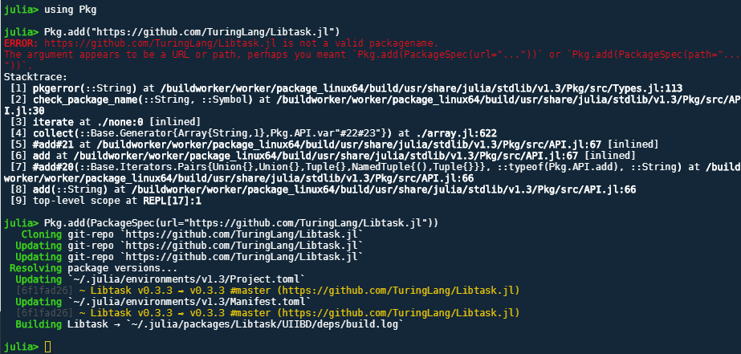

# Julia language educational resources & manuals
## <2020-01-18> CodeRoninSY

# How to start Julia notebook via Jupyter from command line:

<code>$> jupyter notebook --no-browser</code> 

# How to ...

<code>$> julia</code> 
<code>julia> ]</code> 
<code>pkg> add Plots</code> 

-- or --

<code>] develop "https://github.com/dmlc/XGBoost.jl.git"</code> 
<code>] build XGBoost</code> 

# How to add package via github url: 
You can either:  

 <code>] add https://github.com/TuringLang/Libtask.jl</code> 

or equivalently: 

 <code>using Pkg</code> 
 <code>Pkg.add(PackageSpec(url="https://github.com/TuringLang/Libtask.jl")</code> 

----------------------------------------------------------------------
* Julia language github page: 
https://github.com/JuliaLang/julia 

* Julia language learning: 
https://julialang.org/learning/ 

* Julia version management:  
https://github.com/HiroakiMikami/jlenv#installation 

* Julia Observer: 
https://juliaobserver.com/ 

* Julia Bloggers: 
https://www.juliabloggers.com/ 

* The Fast Track to Julia 1.0: 
https://juliadocs.github.io/Julia-Cheat-Sheet/ 

* Curated list of Julia: 
https://github.com/svaksha/Julia.jl#index 

* Introduction to Applied Linear Algebra: 
https://web.stanford.edu/~boyd/vmls/ 
https://github.com/vbartle/VMLS-Companions 

* Statistics with Julia: 
https://people.smp.uq.edu.au/YoniNazarathy/julia-stats/StatisticsWithJulia.pdf 
https://github.com/h-Klok/StatsWithJuliaBook 
R Datasets:  
https://vincentarelbundock.github.io/Rdatasets/datasets.html 

* hydro: simple, relatively small & mildly interesting hydrodynamic code: 
https://github.com/natj/hydro 

* MLJ.jl : Alan Turing Institute Machine Learning Framework: 
https://github.com/alan-turing-institute/MLJ.jl 
https://alan-turing-institute.github.io/MLJTutorials/ 

* MLJ Cheat sheet:  
https://github.com/alan-turing-institute/MLJ.jl/blob/master/docs/src/mlj_cheatsheet.md 

* ScikitLearn.jl:  
https://github.com/cstjean/ScikitLearn.jl 
https://github.com/cstjean/ScikitLearn.jl/blob/master/docs/examples.md 
https://scikitlearnjl.readthedocs.io/en/latest/ 

* XGBoost.jl:  
https://github.com/dmlc/XGBoost.jl 

* Juliabox tutorials: 
https://github.com/JuliaComputing/JuliaBoxTutorials 

* Julia Quantitative Economics: 
https://julia.quantecon.org/ 

* A Deep Introduction to Julia for Data Science and Scientific Computing: 
https://ucidatascienceinitiative.github.io/IntroToJulia/ 

* Differential Equations methods documentation: 
https://github.com/JuliaDiffEq/DiffEqDocs.jl/blob/master/docs/src/solvers/ode_solve.md 

* Sundials: 
https://github.com/JuliaDiffEq/Sundials.jl 

* JuliaDiffEq main github repo: 
https://github.com/JuliaDiffEq 

* DiffEqTutorials.jl: 
https://github.com/JuliaDiffEq/DiffEqTutorials.jl 
https://docs.juliadiffeq.org/dev/types/ode_types/ 
https://archimede.dm.uniba.it/~testset/report/pollu.pdf 
Benchmarks for identification of ODE from time series data: 
http://www.cse.chalmers.se/~dag/identification/Benchmarks/index.html 
https://www.ncbi.nlm.nih.gov/pmc/articles/PMC403766/ 
COPASI : http://copasi.org/ 
ODE Lecture notes: https://www.mat.univie.ac.at/~gerald/ftp/book-ode/ 
A Comparison of ODE Solvers for Dynamical Systems with Impacts: https://nereus.mech.ntua.gr/Documents/pdf_ps/CND17.pdf 
Benchmarks for identification of ordinary differential equations from time series data: https://academic.oup.com/bioinformatics/article/25/6/780/251452 
Comprehensive benchmarking of Markov chain Monte Carlo methods for dynamical systems: https://bmcsystbiol.biomedcentral.com/articles/10.1186/s12918-017-0433-1 

* FEM Finite Element Methods: 
DUNE project: https://www.dune-project.org/ 
Matlab implementation of the Finite element method in elasticity: https://www2.mathematik.hu-berlin.de/~cc/cc_homepage/download/2002-AJ_CC_FS_KR-Matlab_Implementation_FEM_Elasticity.pdf 
Benchmarking the immersed finite element method for fluid–structure interaction problems: https://www.sciencedirect.com/science/article/pii/S0898122115001078 
Netgen: https://ngsolve.org/ 
Mmg Platform: https://www.mmgtools.org/ 
FLTK Fast Light Toolkit ("fulltick" UI builder): https://www.fltk.org/ 
OpenGL: https://www.opengl.org/ 
ONELAB: http://onelab.info/ 
GetDP: http://getdp.info/ 
GMSH: http://gmsh.info/ 
ALBERTA: http://www.alberta-fem.de/ 
FEniCS:  
https://fenicsproject.org/ 
https://fenicsproject.org/download/ 
https://fenics.readthedocs.io/en/latest/installation.html#debian-ubuntu-packages 
Docker Engine: https://docs.docker.com/install/linux/docker-ce/ubuntu/#prerequisites 

* DifferentialEquations.jl documentation: 
https://docs.juliadiffeq.org/stable/ 

* DifferentialEquations.jl Documentation: 
https://docs.juliadiffeq.org/v5.3/index.html 
https://docs.juliadiffeq.org/stable/#DifferentialEquations.jl-Documentation-1 

* DiffEqDevTools Developer documentation: 
https://devdocs.juliadiffeq.org/dev/ 

* Stochastic Differential Equations: 
https://docs.juliadiffeq.org/v5.3/tutorials/sde_example.html#Example-1:-Scalar-SDEs-1 
https://docs.juliadiffeq.org/stable/tutorials/sde_example/#Stochastic-Differential-Equations-1 
https://www.stochasticlifestyle.com/category/math/differential-equations/ 

* Intro to Julia for data science: 
https://www.youtube.com/watch?v=SLE0vz85Rqo&t=1167s 

* Parameter estimation and Bayesian analysis:  
https://docs.juliadiffeq.org/dev/analysis/parameter_estimation/#parameter_estimation-1 
LowLevelParticleFilters: https://github.com/baggepinnen/LowLevelParticleFilters.jl 

* Przemyslaw Szufel (Econometrics, Optimization) github: 
https://github.com/pszufe 

* Bogumil Kaminski (Econometrics, Distributed computing) github: 
https://github.com/bkamins?tab=repositories 

* Jalem Raj Rhit (Econometrics, Machine learning) github:  
https://github.com/Dawny33 

* Julia 1.0 Programming Cookbook:  
https://github.com/PacktPublishing/Julia-1.0-Programming-Cookbook 

* Packtpub github repo for selected books: 
https://github.com/PacktPublishing/ 

* Plot backends:  
https://ucidatascienceinitiative.github.io/IntroToJulia/Html/PlotsJL#Using-Backends 

* Tom Breloff's ML notes:  
http://www.breloff.com/JuliaML-and-Plots/ 
https://www.youtube.com/watch?v=LGB8GvAL4HA 

* GrapRecipes.jl : updated version of PlotRecipes.jl: 
https://github.com/JuliaPlots/GraphRecipes.jl 

* Tom Breloff's github repo:  
https://github.com/tbreloff 

* Global Sensitivity Analysis:  
https://docs.juliadiffeq.org/latest/analysis/global_sensitivity/ 

* Finding maxima and minima of DiffEq Solutions: 
https://tutorials.juliadiffeq.org/html/ode_extras/03-ode_minmax.html 

* Basic parameter estimation, reverse-mode automatic differentiation and inverse problems:  
https://mitmath.github.io/18337/lecture10/estimation_identification 

* JumMP.jl: 
https://github.com/JuliaOpt/JuMP.jl 
http://www.juliaopt.org/JuMP.jl/v0.20.0/ 
https://arxiv.org/abs/1312.1431 

* Double Pendulum; mathematical equations: 
https://www.math24.net/double-pendulum/ 

* An Implicit/Explicit CUDA-Accelerated Solver for the 2D Beeler-Reuter Model: 
https://tutorials.juliadiffeq.org/html/advanced/01-beeler_reuter.html 
https://www.ncbi.nlm.nih.gov/pmc/articles/PMC1283659/?page=14 

* AlgebraicMultigrid: 
https://github.com/JuliaLinearAlgebra/AlgebraicMultigrid.jl 

* diffeqpy : Define and use python for DifferentialEquations.jl solution: 
https://pypi.org/project/diffeqpy/ 

* BLAS functions:  
https://github.com/lopezm94/SugarBLAS.jl 

* A library of premade problems for examples and testing: 
https://github.com/JuliaDiffEq/DiffEqProblemLibrary.jl 
Chris Rackauckas youtube video:  
https://www.youtube.com/watch?v=75SCMIRlNXM 

* Workshop: Solving optimization problems with JuliaOpt: 
https://www.youtube.com/watch?v=nnL7yLMVu6c 
https://github.com/mlubin 
https://github.com/madeleineudell 
https://github.com/madeleineudell/Convex.jl 

* JuliaOpt Optimization related projects in Julia: 
https://www.youtube.com/watch?v=7LNeR299q88 
https://github.com/IainNZ 
https://github.com/JuliaOpt/juliaopt-notebooks/tree/master/notebooks 
https://github.com/JuliaOpt/juliaopt-notebooks 
https://github.com/JuliaNLSolvers 
https://github.com/JuliaNLSolvers/Notebooks 
https://julianlsolvers.github.io/Optim.jl/stable/ 
Constraint Solver: https://opensourc.es/blog/constraint-solver-1 

* DiffEqBenchmarks.jl: benchmarks for the DiffEq solvers: 
https://github.com/JuliaDiffEq/DiffEqBenchmarks.jl 

* QuantECON 
https://quantecon.org/ 

* Modeling Disease Outbreak: 
COVID-19 interactive dashboard: https://www.arcgis.com/apps/opsdashboard/index.html#/bda7594740fd40299423467b48e9ecf6 
Modeling 2019-nCoV: https://systems.jhu.edu/research/public-health/ncov-model-2/ 
A decision-support framework to optimize border control for global outbreak mitigation: https://www.nature.com/articles/s41598-019-38665-w 
https://www.nature.com/articles/s41598-019-38665-w.pdf 
QGIS: https://qgis.org/en/site/ 

----------------------------------------------------------------------------
* DifferentialEquations_jl_documentation_ChrisR.pdf
Notes:
 1. https://docs.juliadiffeq.org/latest/
 2. https://github.com/JuliaDiffEq/DiffEqTutorials.jl
 3. https://github.com/JuliaLang/IJulia.jl
 4. https://github.com/JuliaPlots/Plots.jl
 5. https://github.com/JuliaPy/PyPlot.jl
 6. http://matplotlib.org/
 7. https://github.com/symengine/SymEngine.jl
 8. https://github.com/JuliaDiffEq
 9. https://github.com/JuliaDiffEq/DiffEqBase.jl
 10. https://github.com/JuliaDiffEq/OrdinaryDiffEq.jl
 11. https://github.com/JuliaDiffEq/Sundials.jl
 12. https://github.com/JuliaDiffEq/ODE.jl
 13. https://github.com/luchr/ODEInterface.jl
 14. https://github.com/rveltz/LSODA.jl
 15. https://github.com/JuliaArbTypes/ArbFloats.jl
 16. https://github.com/stevengj/DecFP.jl
 17. https://github.com/JuliaDiffEq/DiffEqTutorials.jl/blob/master/ExtraODEFeatures/Feagin’s%20Order%2010%2C%2012%2C%20and%2014%20methods.ipynb
 18. https://github.com/Keno/SIUnits.jl
 19. https://github.com/ajkeller34/Unitful.jl
 20. https://github.com/JuliaDiffEq/DiffEqTutorials.jl/blob/master/ExtraODEFeatures/Unit%20Checked%20Arithmetic%20via%20Unitful.ipynb
 21. https://github.com/JuliaDiffEq/DiffEqBenchmarks.jl/blob/master/Parallelism/Multithreaded%20Runge-Kutta%20Methods.ipynb
 22. https://github.com/JuliaDiffEq/OrdinaryDiffEq.jl
 23. http://devdocs.juliadiffeq.org/latest
 24. https://github.com/JuliaDiffEq/DifferentialEquations.jl/tree/master/benchmarks
 25. https://github.com/JuliaDiffEq/Sundials.jl
 26. https://github.com/luchr/ODEInterface.jl
 27. https://github.com/JuliaParallel/DistributedArrays.jl
 28. https://github.com/JuliaParallel/PETSc.jl
 29. https://github.com/kshyatt/CUSOLVER.jl
 30. https://github.com/JuliaDiff/ForwardDiff.jl
 31. https://discourse.julialang.org/
 32. https://github.com/JuliaDiffEq/DifferentialEquations.jl/issues
 33. https://gitter.im/JuliaDiffEq/Lobby
 34. http://juliadiffeq.org/news
 35. https://github.com/JuliaDiffEq/DiffEqBase.jl
 36. https://github.com/JuliaDiffEq/StochasticDiffEq.jl
 37. https://github.com/JuliaDiffEq/FiniteElementDiffEq.jl
 38. https://github.com/JuliaDiffEq/DiffEqDevTools.jl
 39. https://github.com/JuliaDiffEq/OrdinaryDiffEq.jl
 40. https://github.com/JuliaDiffEq/AlgebraicDiffEq.jl
 41. https://github.com/JuliaDiffEq/StokesDiffEq.jl
 42. https://github.com/JuliaDiffEq/DiffEqParamEstim.jl
 43. https://github.com/JuliaDiffEq/DiffEqSensitivity.jl
 44. https://github.com/JuliaDiffEq/Sundials.jl
 45. https://github.com/JuliaDiffEq/ODEInterfaceDiffEq.jl
 46. https://github.com/JuliaDiffEq/ParameterizedFunctions.jl
 47. https://github.com/JuliaDiffEq/DiffEqPDEBase.jl
 48. https://github.com/JuliaDiffEq/DelayDiffEq.jl
 49. https://github.com/JuliaDiffEq/DiffEqCallbacks.jl
 50. https://github.com/JuliaDiffEq/DiffEqMonteCarlo.jl
 51. https://github.com/JuliaDiffEq/DiffEqJump.jl
 52. https://github.com/JuliaDiffEq/DiffEqFinancial.jl
 53. https://github.com/JuliaDiffEq/DiffEqBiological.jl
 54. https://github.com/JuliaDiffEq/MultiScaleArrays.jl
 55. https://github.com/JuliaPlots/RecipesBase.jl
 56. https://github.com/JuliaNLSolvers/Optim.jl
 57. https://github.com/mauro3/Parameters.jl
 58. https://github.com/JuliaDiff/ForwardDiff.jl
 59. https://github.com/JuliaMath/IterativeSolvers.jl
 60. https://github.com/simonbyrne/GenericSVD.jl
 61. https://github.com/JuliaLang/Compat.jl
 62. https://github.com/simonbyrne/InplaceOps.jl
 63. https://github.com/symengine/SymEngine.jl
 64. https://github.com/luchr/ODEInterface.jl
 65. https://github.com/JuliaDiffEq/ODE.jl
 66. https://github.com/rveltz/LSODA.jl
